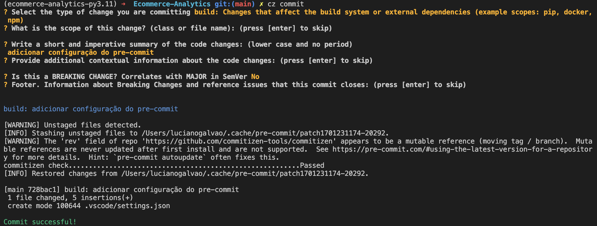
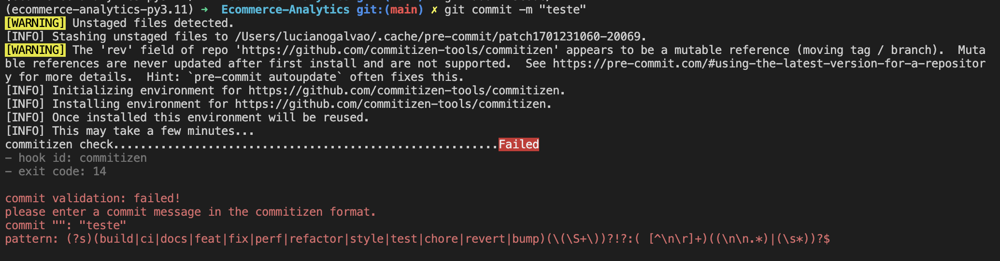

# Ecommerce Analytics

## Objetivo

O objetivo deste projeto é realizar uma análise exploratória de dados de uma empresa de e-commerce, com o intuito de identificar possíveis oportunidades de negócio.

Além disso, vamos construir um Lakehouse utilizando o Delta Lake, que é uma tecnologia open source desenvolvida pela Databricks, que combina os melhores aspectos dos Data Lakes e Data Warehouses, permitindo que os dados sejam armazenados em um formato colunar altamente otimizado, com suporte a ACID transactions, schema enforcement e versioning.

### Objetivos secundários

1) Trabalhar com commites semânticos (como Conventional Commits)

O que NÃO são commits semânticos:

```bash
git commit -m "first commit"
git commit -m "arrumei alguns arquivos,  vai funcionar agora"
git commit -m "agora vai… arrumei mais coisas, mas agora compila"
```

O problema com esses commits é que eles não dizem nada sobre o que foi feito. Eles não são úteis para ninguém que não seja o autor do commit, e mesmo assim, só serão úteis por um curto período de tempo.

O que são commits semânticos?
Commits semânticos são uma convenção para adicionar metadados (valor) aos commits. Para ele seja útil para outros usuários, para o próprio autor e para o projeto de maneira geral.
 
O formato é o seguinte:
```bash
<tipo>: <descrição>
```

Os tipos disponíveis são:
- feat: nova funcionalidade
- fix: correção de bug
- docs: alteração na documentação
- style: formatação de código, ponto e vírgula faltando, etc; - não altera o significado
- refactor: refatoração de código, sem alterar a semântica
- test: adição ou correção de testes
- chore: alterações no processo de build, atualização de - dependências, etc; não altera o código em si

Exemplo 1: 
```bash
feat: acidicionado camada de Delta Lake
```

Exemplo 2:
```bash
fix: corrigido bug de escrita no Delta Lake
```

Exemplo 3:
```bash
docs: adicionado documentação sobre Delta Lake
```

O grande desafio é fazer com que todos os desenvolvedores sigam essa convenção. Para isso, vamos automatizar o processo de commit, utilizando o [Commitizen](https://github.com/commitizen-tools/commitizen) e uma ferramenta de [pre-commit](https://pre-commit.com/) para garantir que os commits sejam feitos de acordo com a convenção.

Para instalar o Commitizen, vamos utilizar o [Poetry](https://python-poetry.org/)

```bash
poetry add commitizen --group dev
```

Na maior parte do tempo só vamos usar o comando `cz commit` para fazer os commits

```bash
cz commit
```

Para garantir que não vamos esquecer do commit semantico, vamos utilizar o [pre-commit](https://pre-commit.com/)

```bash
poetry add pre-commit --group dev
```

Para configurar o pre-commit, vamos criar um arquivo `.pre-commit-config.yaml` na raiz do projeto, com o seguinte conteúdo:

```yaml
repos:
  - repo: https://github.com/commitizen-tools/commitizen
    rev: master
    hooks:
      - id: commitizen
        stages: [commit-msg]
```

Para instalar os hooks do pre-commit, vamos executar o seguinte comando:

```bash
pre-commit install --hook-type commit-msg
```

Agora, sempre que executarmos o comando `cz commit`, vamos ser guiados para fazer o commit semântico.



Se tentarmos fazer um commit sem ser semântico, vamos receber uma mensagem de erro



Dessa forma, garantimos que todos os commits vão seguir a convenção, e que os commits vão ser úteis para o projeto.