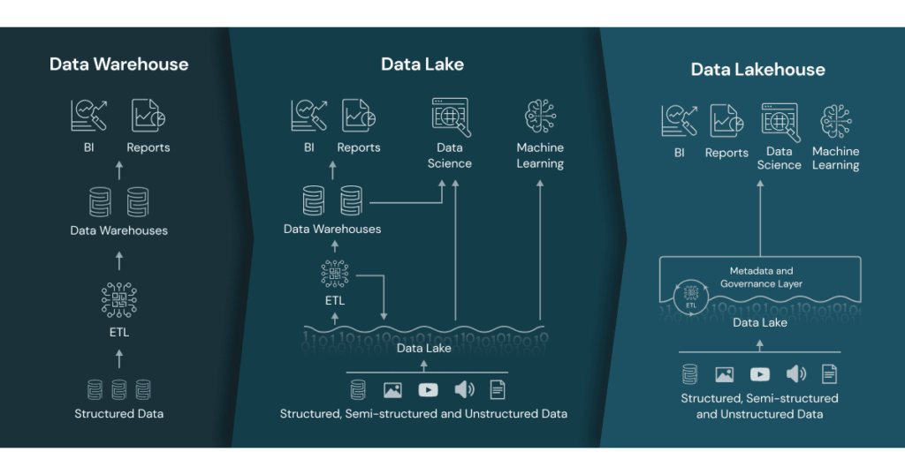

# Ecommerce Analytics

## Objetivo

O objetivo deste projeto é realizar uma análise exploratória de dados de uma empresa de e-commerce, com o intuito de identificar possíveis oportunidades de negócio.

Além disso, vamos construir um Lakehouse utilizando o Delta Lake, que é uma tecnologia open source desenvolvida pela Databricks, que combina os melhores aspectos dos Data Lakes e Data Warehouses, permitindo que os dados sejam armazenados em um formato colunar altamente otimizado, com suporte a ACID transactions, schema enforcement e versioning.



## Índice

- [Ecommerce Analytics](#ecommerce-analytics)
  - [Objetivo](#objetivo)
  - [Índice](#índice)
  - [Lakehouse](#lakehouse)
    - [Pyspark](#pyspark)
    - [Delta Lake](#delta-lake)
    - [ETL](#etl)
    - [Padrões e Estruturas Utilizadas](#padrões-e-estruturas-utilizadas)
    - [Conclusão](#conclusão)
    - [Commites semânticos e pre-commit](#commites-semânticos-e-pre-commit)

## Lakehouse

### Pyspark

O PySpark é a API do Spark para Python. Ele permite que você execute o Spark usando o Python como sua linguagem principal. O PySpark pode ser usado para trabalhar com conjuntos de dados distribuídos usando o DataFrame API do Spark e o SQL.

Para instalar o PySpark, vamos utilizar o [Poetry](https://python-poetry.org/)

```bash
poetry add pyspark
```

### Delta Lake

Delta Lake é uma tecnologia open source desenvolvida pela Databricks, que combina os melhores aspectos dos Data Lakes e Data Warehouses, permitindo que os dados sejam armazenados em um formato colunar altamente otimizado, com suporte a ACID transactions, schema enforcement e versioning.

Para instalar o Delta Lake no Spark, vamos utilizar o delta-spark


```bash
poetry add delta-spark
```

### ETL

O arquivo Python `src/etl` define uma classe `CSVToDeltaWriter` para realizar operações de ETL (Extract, Transform, Load). O objetivo principal dessa classe é ler arquivos CSV de diretórios específicos e gravar os dados como Delta Tables. Aqui está um resumo dos padrões e funcionalidades usadas:

### Padrões e Estruturas Utilizadas

1. **Programação Orientada a Objetos (POO)**: O código utiliza a abordagem de POO com a definição da classe `CSVToDeltaWriter`. Esta classe encapsula métodos e atributos relacionados à tarefa de leitura e gravação de dados.
    
2. **Inicialização de Atributos no Construtor**: No método `__init__`, são inicializados dois atributos - `input_dirs` e `output_dir`. Estes atributos armazenam os diretórios de entrada e saída, respectivamente.
    
3. **Método para Criação de Diretórios**: O método `create_output_dir` verifica se o diretório de saída existe e, se não, cria-o. Isso garante que o diretório de saída esteja disponível antes de tentar escrever os dados.
    
4. **Leitura de Arquivos CSV**: O método `read_csv` utiliza o Spark para ler arquivos CSV, com a leitura dos cabeçalhos e inferência de esquema.
    
5. **Escrita em Formato Delta**: `write_to_delta` é um método que escreve DataFrames do Spark em formato Delta no caminho especificado. Ele usa a sobrescrita (`overwrite`) como modo de gravação.
    
6. **Execução Principal no Método `execute`**: Este método percorre os diretórios de entrada, lê cada arquivo CSV, transforma-os em DataFrames do Spark, e então os grava como Delta Tables.
    
7. **Configuração do SparkSession**: Utiliza `SparkSession` com configurações específicas para Delta Lake, como extensões e catálogo.
    
8. **Encerramento da Sessão Spark**: Após a execução das operações ETL, a sessão do Spark é encerrada com `spark.stop()`.
    
9. **Execução Condicional com `if __name__ == "__main__"`**: Este padrão é usado para executar o código quando o script é rodado diretamente, e não quando importado como um módulo.
    

### Conclusão

O script é um exemplo claro de um pipeline de ETL em Python usando Spark e Delta Lake, com foco na leitura de dados de arquivos CSV e gravação em formato Delta. Ele segue boas práticas de programação em Python, como encapsulamento em classes, e demonstra a integração eficiente com ferramentas de processamento de dados como Apache Spark e Delta Lake.

### Commites semânticos e pre-commit

1) Trabalhar com commites semânticos (como Conventional Commits)

O que NÃO são commits semânticos:

```bash
git commit -m "first commit"
git commit -m "arrumei alguns arquivos,  vai funcionar agora"
git commit -m "agora vai… arrumei mais coisas, mas agora compila"
```

O problema com esses commits é que eles não dizem nada sobre o que foi feito. Eles não são úteis para ninguém que não seja o autor do commit, e mesmo assim, só serão úteis por um curto período de tempo.

Motivos para usar:
Commits semânticos são uma convenção para adicionar metadados (valor) aos commits. Para ele seja útil para outros usuários, para o próprio autor e para o projeto de maneira geral. Em outras palavras, o commit semântico é uma forma de padronizar os commits, para que eles sejam úteis para o projeto. No longo prazo, isso vai facilitar a manutenção do projeto, e vai ajudar a entender o que foi feito em cada commit, diminuir o tempo de onboarding de novos desenvolvedores, e facilitar a busca por bugs.

Motivos para não usar:
Preguiça, falta de conhecimento, falta de tempo, falta de disciplina, etc.
 
O formato é o seguinte:
```bash
<tipo>: <descrição>
```

Os tipos disponíveis são:
- feat: nova funcionalidade
- fix: correção de bug
- docs: alteração na documentação
- style: formatação de código, ponto e vírgula faltando, etc; - não altera o significado
- refactor: refatoração de código, sem alterar a semântica
- test: adição ou correção de testes
- chore: alterações no processo de build, atualização de - dependências, etc; não altera o código em si

Exemplo 1: 
```bash
feat: acidicionado camada de Delta Lake
```

Exemplo 2:
```bash
fix: corrigido bug de escrita no Delta Lake
```

Exemplo 3:
```bash
docs: adicionado documentação sobre Delta Lake
```

O grande desafio é fazer com que todos os desenvolvedores sigam essa convenção. Para isso, vamos automatizar o processo de commit, utilizando o [Commitizen](https://github.com/commitizen-tools/commitizen) e uma ferramenta de [pre-commit](https://pre-commit.com/) para garantir que os commits sejam feitos de acordo com a convenção.

Para instalar o Commitizen, vamos utilizar o [Poetry](https://python-poetry.org/)

```bash
poetry add commitizen --group dev
```

Na maior parte do tempo só vamos usar o comando `cz commit` para fazer os commits

```bash
cz commit
```

Para garantir que não vamos esquecer do commit semantico, vamos utilizar o [pre-commit](https://pre-commit.com/)

```bash
poetry add pre-commit --group dev
```

Para configurar o pre-commit, vamos criar um arquivo `.pre-commit-config.yaml` na raiz do projeto, com o seguinte conteúdo:

```yaml
repos:
  - repo: https://github.com/commitizen-tools/commitizen
    rev: master
    hooks:
      - id: commitizen
        stages: [commit-msg]
```

Para instalar os hooks do pre-commit, vamos executar o seguinte comando:

```bash
pre-commit install --hook-type commit-msg
```

Agora, sempre que executarmos o comando `cz commit`, vamos ser guiados para fazer o commit semântico.


Se tentarmos fazer um commit sem ser semântico, vamos receber uma mensagem de erro


Dessa forma, garantimos que todos os commits vão seguir a convenção, e que os commits vão ser úteis para o projeto.